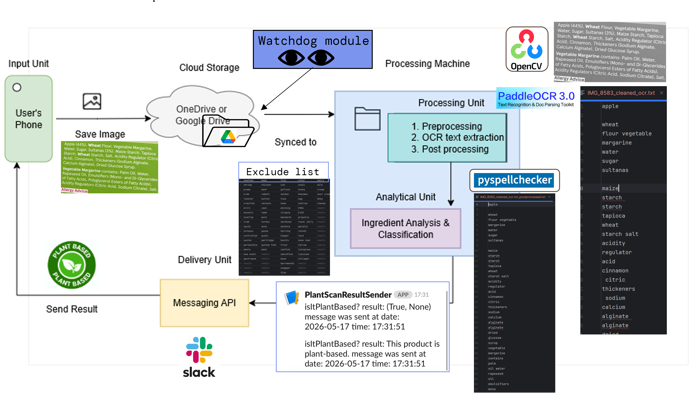
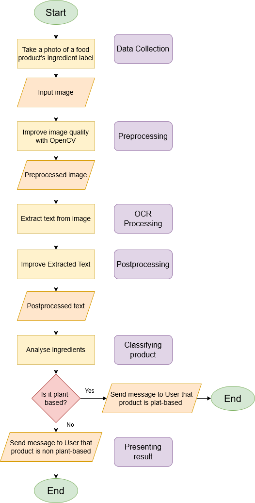

# Plantscan

**A plant-based food identifier MVP leveraging OCR technology**

PlantScan is an automated image-to-classification pipeline developed as part of my final year project for the BSc Honours in Software Development degree at MTU Cork.

The project uses **Optical Character Recognition (OCR)**, image preprocessing, text processing, and rule-based classification to determine whether a food product is plant-based from an image of its ingredient label.

## Project Background

Following a plant-based diet often requires manually checking ingredient lists to avoid animal-derived ingredients. PlantScan was created to reduce that manual effort by automating the process.

A user provides a cropped image of a food label. The system detects the new image, preprocesses it, extracts the text using OCR, cleans and interprets the extracted text, classifies the product using a rule-based approach, and delivers the result through Slack.

The project was evaluated using a balanced dataset of **60 images**.

## Project Goals

- Reduce the manual effort required to review ingredient lists.
- Apply image preprocessing and text postprocessing to improve OCR output.
- Extract ingredient text from food-label images using PaddleOCR.
- Classify products as plant-based or non-plant-based using a rule-based approach.
- Deliver the classification result automatically through Slack.
- Evaluate OCR performance before and after postprocessing.

## System Overview and Flowchart

## Processing Pipeline

### 1. Data Collection

* The user takes a photo using their phone.
* The image is cropped using the phone's photo application.
* The image is uploaded to a designated Google Drive folder.

### 2. File Detection

* The Google Drive folder is monitored by **Watchdog**.
* When a new image is detected, Watchdog automatically triggers the processing pipeline.

### 3. Image Preprocessing

* If the image is in **HEIC** format, it is converted to **JPG**.
* The image is converted to **grayscale**.

### 4. OCR Text Extraction

* **PaddleOCR** is used to extract text from the processed image.

### 5. Text Post-processing

* The extracted text is cleaned and corrected using **pyspellchecker**.

### 6. Classification

* The processed text is checked against a predefined **exclusion list**.
* If a match is found, the product is classified as **non-plant-based**.
* If no match is found, the product is classified as **plant-based**.

### 7. Result Notification

* The classification result is sent back to the user's phone via **Slack**.

## Module Overview

### 1. Entry Point

`my_main_refactor.py`

The main script starts the application by calling `start_folder_watcher()`.

### 2. Folder Watcher

`folder_watcher_utils.py`

Uses the **Watchdog** library to monitor a folder defined in `config_refactor.py`. When a new cropped image is added, the watcher triggers the processing pipeline.

### 3. Image Processing

`image_utils.py`

- greyscale conversion

### 4. OCR

`ocr_utils.py`

Extracts text from food-label images using **PaddleOCR**.

### 5. Text Processing

`text_utils.py`

Contains helper functions for loading, reading, cleaning, and formatting extracted text.

Postprocessing functionality is also provided through:

`postprocess_utils_return_filepath.py`

This stage uses **pySpellChecker** to improve OCR output for evaluation workflows.

### 6. Product Classification

`pb_checker.py`

Contains the rule-based classification logic used to determine whether a product is plant-based or non-plant-based.

The classifier uses `exclude_list.csv` to identify ingredients that should result in a product being classified as non-plant-based.

### 7. Result Delivery

`messaging_utils.py`

Sends the final classification result through **Slack**.

### 8. Configuration

`config_refactor.py`

Defines the folder paths used throughout the application.

### 9. Evaluation

`eval_utils_copy_postp_return_filepath_not_folder.py`

Contains the evaluation logic and metric calculations used to compare OCR performance.
